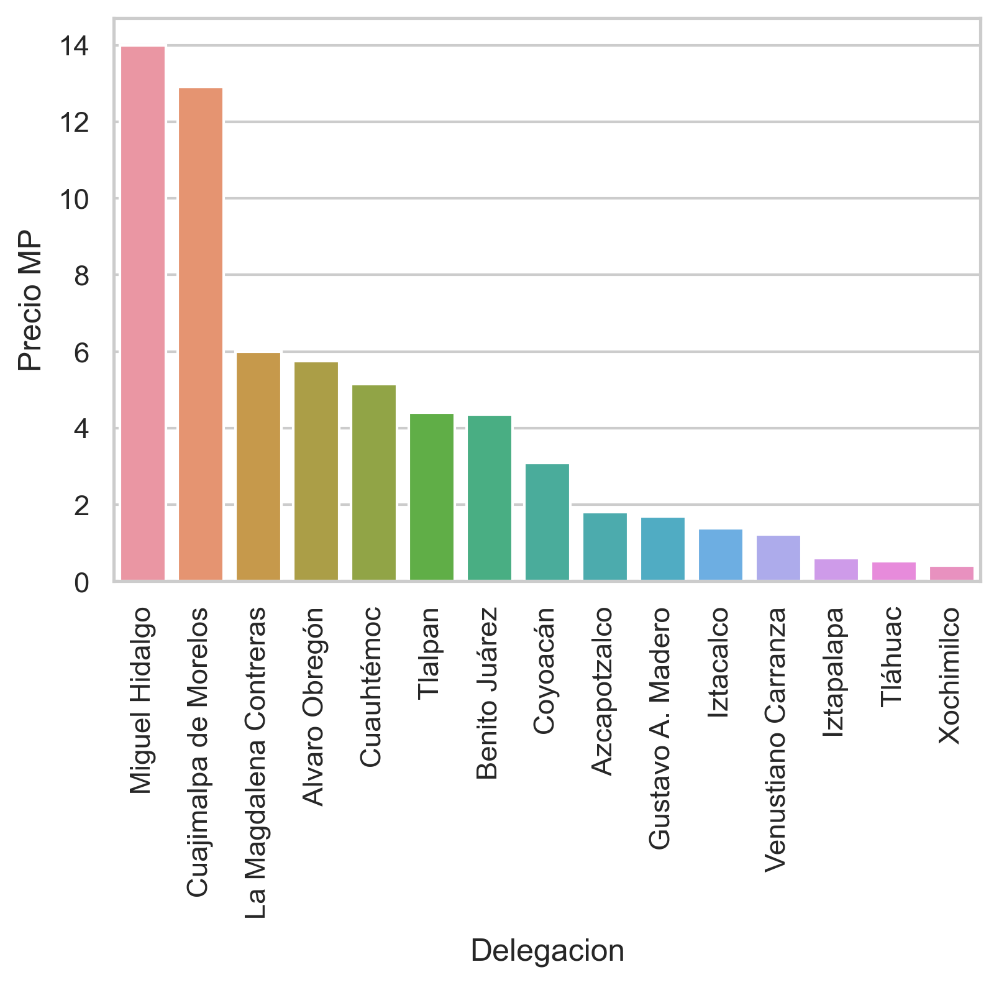
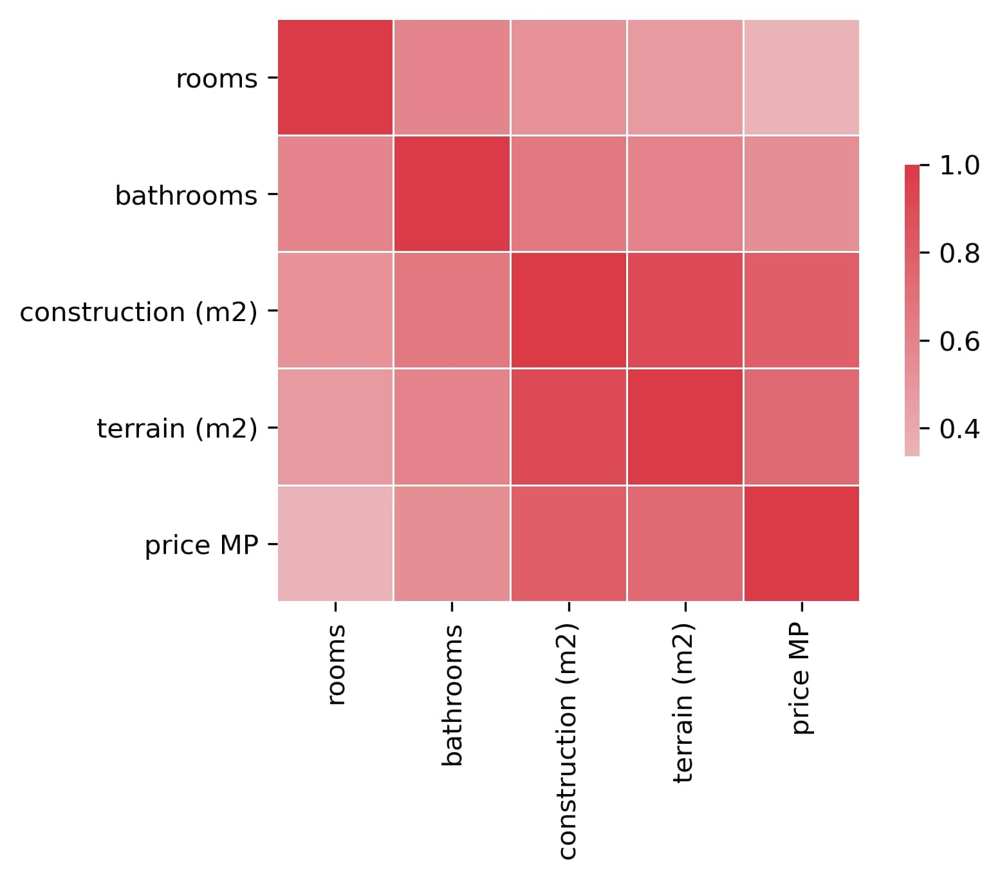

# Ismael Lopez Portfolio
Data science portfolio
# [**Project 1:** Apartment Price Estimator Project Overview](https://github.com/ismael-lopezb/ds_realestate_proj)
* Created a tool that estimates apartment price in Mexico City to help construction companies estimate the potential price of their apartments.
* Scraped over 25,000 apartment descriptions from Inmueble24 using python and BeautifulSoup
* Engineered features from the text of each apartment description to quantify the value of amenities, such as pool, garden, etc.
* Optimized Linear, Ridge, and Gradient Boosting Regressor using GridsearchCV to reach the best model.
 
# [**Project 2:** Job Change of Data Scientists, Project Overview](https://github.com/ismael-lopezb/employee_class_project)
* Predict if a data scientist candidate will work for a company.
* Cleaned over 20,000 data extracted from Kaggle.
* Performed an exploratory data analysis (EDA) and extracted valuable information from the data.
* Optimized Logistic Regression, K-Nearest Neighbours, Decission-Tree Classifier and Random Forest Classifier using GridsearchCV to reach the best model.
